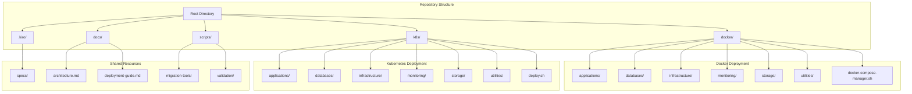

# Infrastructure Organization Design Document

## Overview

This design document outlines the architecture for organizing and standardizing the infrastructure repository to maintain clear separation between Docker and Kubernetes deployments while ensuring both deployment methods can effectively manage the same applications and services. The solution provides a unified, maintainable infrastructure-as-code repository supporting both containerized and orchestrated deployments.

## Architecture

### High-Level Architecture



### Directory Structure Design

```
infrastructure-repo/
├── docker/                          # Docker Compose deployments
│   ├── applications/                 # Application services
│   │   ├── baserow/
│   │   ├── nocodb/
│   │   ├── open-webui/
│   │   └── ...
│   ├── databases/                    # Database services
│   │   ├── postgres/
│   │   ├── mysql/
│   │   ├── redis/
│   │   └── ...
│   ├── infrastructure/               # Core infrastructure
│   │   ├── traefik/
│   │   ├── vault/
│   │   ├── consul/
│   │   └── ...
│   ├── monitoring/                   # Monitoring stack
│   │   ├── prometheus/
│   │   ├── grafana/
│   │   └── ...
│   ├── storage/                      # Storage services
│   │   └── minio/
│   ├── utilities/                    # Utility services
│   │   ├── backup/
│   │   ├── phpmyadmin/
│   │   └── ...
│   ├── docker-compose-manager.sh     # Management script
│   └── README.md                     # Docker deployment guide
├── k8s/                             # Kubernetes deployments
│   ├── applications/                 # Application manifests
│   │   ├── baserow.yaml
│   │   ├── nocodb.yaml
│   │   └── ...
│   ├── databases/                    # Database manifests
│   │   ├── postgres.yaml
│   │   ├── mysql.yaml
│   │   └── ...
│   ├── infrastructure/               # Infrastructure manifests
│   │   ├── ingress-controller.yaml
│   │   ├── cert-manager.yaml
│   │   └── ...
│   ├── monitoring/                   # Monitoring manifests
│   │   ├── prometheus.yaml
│   │   ├── grafana.yaml
│   │   └── ...
│   ├── storage/                      # Storage classes and PVCs
│   │   ├── storage-class.yaml
│   │   └── ...
│   ├── namespace/                    # Namespace definitions
│   │   └── namespaces.yaml
│   ├── deploy.sh                     # Deployment script
│   └── README.md                     # Kubernetes deployment guide
├── docs/                            # Documentation
│   ├── architecture.md              # Architecture overview
│   ├── deployment-guide.md          # Deployment instructions
│   ├── migration-guide.md           # Migration between Docker/K8s
│   └── troubleshooting.md           # Common issues and solutions
├── scripts/                         # Utility scripts
│   ├── migration/                   # Docker to K8s migration tools
│   ├── validation/                  # Configuration validation
│   └── backup/                      # Backup automation
└── .kiro/                          # Kiro specifications
    └── specs/
        └── infrastructure-organization/
```

## Components and Interfaces

### 1. Docker Deployment Layer

#### Docker Compose Manager
- **Purpose**: Centralized management of all Docker Compose services
- **Features**:
  - Category-based service organization
  - Dependency management and startup ordering
  - Shared network creation and management
  - Health checking and status reporting
  - Resilient deployment with error handling

#### Service Categories
- **Applications**: Business applications and user-facing services
- **Databases**: Data persistence layer (PostgreSQL, MySQL, Redis, MongoDB, etc.)
- **Infrastructure**: Core infrastructure services (Traefik, Vault, Consul, etc.)
- **Monitoring**: Observability stack (Prometheus, Grafana, ELK)
- **Storage**: Object storage and file systems (MinIO)
- **Utilities**: Support services (phpMyAdmin, backup tools)

### 2. Kubernetes Deployment Layer

#### Kubernetes Manifests Structure
- **Namespace Isolation**: Separate namespaces for different service categories
- **Resource Management**: Proper resource requests and limits
- **ConfigMap/Secret Management**: Centralized configuration management
- **Service Discovery**: Internal DNS and service mesh integration

#### Deployment Script
- **Purpose**: Automated Kubernetes deployment with proper ordering
- **Features**:
  - Namespace creation and management
  - Dependency resolution
  - Health checking and rollout status
  - Cleanup and rollback capabilities

### 3. Configuration Management

#### Environment Variables
```yaml
# Docker (.env files)
POSTGRES_PASSWORD=secure_password
REDIS_PASSWORD=redis_secure
TRAEFIK_DOMAIN=localhost

# Kubernetes (ConfigMaps/Secrets)
apiVersion: v1
kind: Secret
metadata:
  name: postgres-credentials
data:
  password: <base64-encoded-password>
```

#### Shared Configuration
- **Network Configuration**: Consistent network naming across deployments
- **Service Discovery**: Standardized service naming conventions
- **Security Policies**: Unified security configurations

### 4. Management and Automation

#### Docker Management Script
```bash
# Category-based operations
./docker-compose-manager.sh category databases up
./docker-compose-manager.sh category applications down

# Individual service management
./docker-compose-manager.sh up postgres redis
./docker-compose-manager.sh logs grafana

# Resilient deployment
./docker-compose-manager.sh up-resilient
```

#### Kubernetes Deployment Script
```bash
# Full deployment
./deploy.sh deploy

# Category-specific deployment
./deploy.sh deploy databases
./deploy.sh deploy monitoring

# Cleanup
./deploy.sh cleanup
```

## Data Models

### Service Configuration Model
```yaml
# Service definition structure
service:
  name: string
  category: enum[applications, databases, infrastructure, monitoring, storage, utilities]
  docker:
    path: string
    dependencies: array[string]
    networks: array[string]
    ports: array[object]
  kubernetes:
    namespace: string
    manifests: array[string]
    dependencies: array[string]
  configuration:
    environment_variables: object
    secrets: array[string]
    volumes: array[object]
```

### Deployment State Model
```yaml
# Deployment tracking
deployment:
  platform: enum[docker, kubernetes]
  services: array[object]
    - name: string
      status: enum[running, stopped, error, pending]
      health: enum[healthy, unhealthy, unknown]
      last_updated: timestamp
```

## Error Handling

### Docker Deployment Error Handling
1. **Service Dependency Failures**: Continue with independent services
2. **Port Conflicts**: Automatic port conflict detection and resolution
3. **Network Issues**: Automatic shared network creation
4. **Resource Constraints**: Graceful degradation with warnings

### Kubernetes Deployment Error Handling
1. **Resource Quotas**: Pre-deployment validation of resource requirements
2. **Namespace Issues**: Automatic namespace creation with proper RBAC
3. **Storage Provisioning**: Dynamic PV provisioning with fallback options
4. **Image Pull Failures**: Retry mechanisms with exponential backoff

### Common Error Scenarios
```bash
# Docker error handling
if ! docker network ls | grep -q shared-networks; then
    docker network create shared-networks
fi

# Kubernetes error handling
kubectl apply -f namespace/ || kubectl create namespace book-stack
kubectl wait --for=condition=available deployment/postgres --timeout=300s
```

## Testing Strategy

### 1. Unit Testing
- **Configuration Validation**: Validate Docker Compose and Kubernetes manifests
- **Script Testing**: Test management scripts with various scenarios
- **Network Testing**: Verify network connectivity between services

### 2. Integration Testing
- **Service Communication**: Test inter-service communication
- **Data Persistence**: Verify data persistence across restarts
- **Load Balancing**: Test traffic distribution and failover

### 3. End-to-End Testing
- **Full Stack Deployment**: Deploy complete infrastructure stack
- **User Workflows**: Test complete user journeys
- **Disaster Recovery**: Test backup and restore procedures

### 4. Performance Testing
- **Resource Utilization**: Monitor CPU, memory, and storage usage
- **Scalability**: Test horizontal and vertical scaling
- **Network Performance**: Measure latency and throughput

### Testing Automation
```bash
# Docker testing
./scripts/validation/test-docker-deployment.sh

# Kubernetes testing
./scripts/validation/test-k8s-deployment.sh

# Cross-platform validation
./scripts/validation/compare-deployments.sh
```

## Security Considerations

### 1. Secrets Management
- **Docker**: Environment files with restricted permissions
- **Kubernetes**: Native Secrets with encryption at rest
- **Vault Integration**: Centralized secret management for both platforms

### 2. Network Security
- **Docker**: Custom bridge networks with service isolation
- **Kubernetes**: Network policies for pod-to-pod communication
- **Ingress Security**: TLS termination and rate limiting

### 3. Access Control
- **Docker**: Host-based access control and user namespaces
- **Kubernetes**: RBAC with least privilege principles
- **Service Accounts**: Dedicated service accounts for each component

### 4. Image Security
- **Base Images**: Use official, minimal base images
- **Vulnerability Scanning**: Automated image scanning in CI/CD
- **Image Signing**: Container image signing and verification

## Migration and Compatibility

### Docker to Kubernetes Migration
```bash
# Migration utility
./scripts/migration/docker-to-k8s.sh [service-name]

# Configuration conversion
./scripts/migration/convert-compose-to-k8s.sh docker/applications/baserow/
```

### Kubernetes to Docker Migration
```bash
# Reverse migration utility
./scripts/migration/k8s-to-docker.sh [service-name]

# Manifest to compose conversion
./scripts/migration/convert-k8s-to-compose.sh k8s/applications/baserow.yaml
```

### Configuration Synchronization
- **Automated Sync**: Scripts to keep configurations in sync
- **Validation**: Cross-platform configuration validation
- **Drift Detection**: Identify configuration differences between platforms